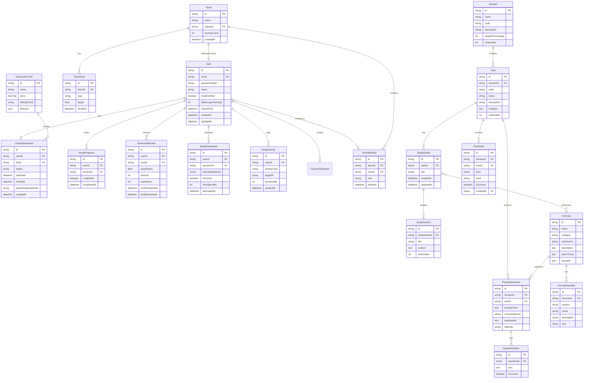

# Design Document: PMP Study Application

## Overview

The PMP Study Application is a web-based learning platform designed to help candidates prepare for the 2026 PMP certification exam. The system follows a modern three-tier architecture with a React frontend, Node.js/Express backend, and PostgreSQL database. PayPal handles subscription payments, while the application manages study content, user progress, and analytics.

The application organizes all content according to PMI's 2026 Exam Content Outline with three domains (People, Process, Business Environment) and their associated tasks. Users progress through study guides, flashcards, and practice questions while the system tracks performance and provides personalized recommendations.

## Architecture


### Technology Stack

- **Frontend**: React 18 with TypeScript, TailwindCSS, React Query
- **Backend**: Node.js with Express, TypeScript
- **Database**: PostgreSQL 15 with Prisma ORM
- **Cache**: Redis for session management and content caching
- **Authentication**: JWT with refresh tokens
- **Payments**: PayPal REST API with webhooks
- **Testing**: Jest, React Testing Library, fast-check for property-based testing

## Components and Interfaces

### Authentication Service

```typescript
interface AuthService {
  register(data: RegisterInput): Promise<AuthResult>;
  login(credentials: LoginInput): Promise<AuthResult>;
  logout(userId: string): Promise<void>;
  refreshToken(refreshToken: string): Promise<TokenPair>;
  requestPasswordReset(email: string): Promise<void>;
  resetPassword(token: string, newPassword: string): Promise<void>;
  verifyEmail(token: string): Promise<void>;
}

interface RegisterInput {
  email: string;
  password: string;
  name: string;
}

interface LoginInput {
  email: string;
  password: string;
}

interface AuthResult {
  user: User;
  tokens: TokenPair;
}

interface TokenPair {
  accessToken: string;
  refreshToken: string;
  expiresIn: number;
}
```

### Subscription Service

```typescript
interface SubscriptionService {
  getTiers(): Promise<SubscriptionTier[]>;
  getUserSubscription(userId: string): Promise<UserSubscription>;
  createSubscription(userId: string, tierId: string): Promise<PayPalOrder>;
  activateSubscription(userId: string, paypalOrderId: string): Promise<UserSubscription>;
  cancelSubscription(userId: string): Promise<void>;
  handleWebhook(event: PayPalWebhookEvent): Promise<void>;
}

interface SubscriptionTier {
  id: string;
  name: 'free' | 'mid-level' | 'high-end' | 'corporate';
  price: number;
  billingPeriod: 'monthly' | 'annual';
  features: TierFeatures;
}

interface TierFeatures {
  studyGuidesAccess: 'limited' | 'full';
  flashcardsLimit: number | 'unlimited';
  practiceQuestionsPerDomain: number;
  customFlashcards: boolean;
  mockExams: boolean;
  formulaCalculator: boolean;
  advancedAnalytics: boolean;
  personalizedStudyPlan: boolean;
  teamManagement: boolean;
  dedicatedSupport: boolean;
}

interface UserSubscription {
  userId: string;
  tierId: string;
  tier: SubscriptionTier;
  status: 'active' | 'cancelled' | 'expired' | 'grace_period';
  startDate: Date;
  endDate: Date;
  paypalSubscriptionId?: string;
}
```

### Study Content Service

```typescript
interface StudyContentService {
  getDomains(): Promise<Domain[]>;
  getDomainById(domainId: string): Promise<Domain>;
  getTasksByDomain(domainId: string): Promise<Task[]>;
  getStudyGuide(taskId: string): Promise<StudyGuide>;
  markSectionComplete(userId: string, sectionId: string): Promise<void>;
  searchContent(query: string): Promise<SearchResult[]>;
  getUserProgress(userId: string): Promise<StudyProgress>;
}

interface Domain {
  id: string;
  name: string;
  code: string; // e.g., "PEOPLE", "PROCESS", "BUSINESS"
  description: string;
  weightPercentage: number;
  tasks: Task[];
}

interface Task {
  id: string;
  domainId: string;
  code: string; // e.g., "1.1", "2.3"
  name: string;
  description: string;
  enablers: string[];
}

interface StudyGuide {
  id: string;
  taskId: string;
  title: string;
  sections: StudySection[];
  relatedFormulas: Formula[];
  relatedFlashcardIds: string[];
  relatedQuestionIds: string[];
}

interface StudySection {
  id: string;
  title: string;
  content: string; // Markdown content
  order: number;
}
```

### Flashcard Service

```typescript
interface FlashcardService {
  getFlashcardsByDomain(domainId: string, userId: string): Promise<Flashcard[]>;
  getFlashcardsByTask(taskId: string, userId: string): Promise<Flashcard[]>;
  startSession(userId: string, options: SessionOptions): Promise<FlashcardSession>;
  recordResponse(sessionId: string, cardId: string, response: FlashcardResponse): Promise<void>;
  endSession(sessionId: string): Promise<SessionStats>;
  createCustomFlashcard(userId: string, data: CreateFlashcardInput): Promise<Flashcard>;
  getNextReviewCards(userId: string, limit: number): Promise<Flashcard[]>;
}

interface Flashcard {
  id: string;
  domainId: string;
  taskId: string;
  front: string; // Question or term
  back: string;  // Answer or definition
  isCustom: boolean;
  createdBy?: string;
}

interface FlashcardResponse {
  cardId: string;
  rating: 'know_it' | 'learning' | 'dont_know';
  timeSpentMs: number;
}

interface SessionStats {
  totalCards: number;
  knowIt: number;
  learning: number;
  dontKnow: number;
  totalTimeMs: number;
  averageTimePerCard: number;
}

// Spaced Repetition Data
interface CardReviewData {
  cardId: string;
  userId: string;
  easeFactor: number;      // SM-2 algorithm ease factor
  interval: number;        // Days until next review
  repetitions: number;     // Successful repetitions in a row
  nextReviewDate: Date;
  lastReviewDate: Date;
}
```

### Practice Question Service

```typescript
interface PracticeQuestionService {
  getQuestionsByDomain(domainId: string): Promise<PracticeQuestion[]>;
  getQuestionsByTask(taskId: string): Promise<PracticeQuestion[]>;
  startPracticeSession(userId: string, options: PracticeOptions): Promise<PracticeSession>;
  submitAnswer(sessionId: string, questionId: string, answerId: string): Promise<AnswerResult>;
  endSession(sessionId: string): Promise<PracticeSessionResult>;
  startMockExam(userId: string): Promise<MockExam>;
  submitMockExam(examId: string): Promise<MockExamResult>;
  getFlaggedQuestions(userId: string): Promise<PracticeQuestion[]>;
}

interface PracticeQuestion {
  id: string;
  domainId: string;
  taskId: string;
  questionText: string;
  options: QuestionOption[];
  correctOptionId: string;
  explanation: string;
  difficulty: 'easy' | 'medium' | 'hard';
  relatedFormulaIds: string[];
}

interface QuestionOption {
  id: string;
  text: string;
  isCorrect: boolean;
}

interface PracticeOptions {
  domainIds?: string[];
  taskIds?: string[];
  questionCount: number;
  includeAnswered: boolean;
  prioritizeFlagged: boolean;
}

interface AnswerResult {
  isCorrect: boolean;
  correctOptionId: string;
  explanation: string;
  timeSpentMs: number;
}

interface PracticeSessionResult {
  totalQuestions: number;
  correctAnswers: number;
  scorePercentage: number;
  averageTimePerQuestion: number;
  domainBreakdown: DomainScore[];
  flaggedQuestions: string[];
}

interface MockExam {
  id: string;
  userId: string;
  questions: PracticeQuestion[];
  timeLimit: number; // 230 minutes for PMP
  startedAt: Date;
}
```

### Formula Service

```typescript
interface FormulaService {
  getAllFormulas(): Promise<Formula[]>;
  getFormulasByCategory(category: FormulaCategory): Promise<Formula[]>;
  getFormulaById(formulaId: string): Promise<Formula>;
  calculateFormula(formulaId: string, inputs: Record<string, number>): Promise<CalculationResult>;
  getRelatedQuestions(formulaId: string): Promise<PracticeQuestion[]>;
}

interface Formula {
  id: string;
  name: string;
  category: FormulaCategory;
  expression: string;        // e.g., "CPI = EV / AC"
  variables: FormulaVariable[];
  description: string;
  whenToUse: string;
  example: FormulaExample;
}

type FormulaCategory = 
  | 'earned_value'
  | 'scheduling'
  | 'cost'
  | 'communication'
  | 'probability'
  | 'procurement';

interface FormulaVariable {
  symbol: string;
  name: string;
  description: string;
  unit?: string;
}

interface FormulaExample {
  scenario: string;
  inputs: Record<string, number>;
  solution: string;
  result: number;
}

interface CalculationResult {
  formulaId: string;
  inputs: Record<string, number>;
  result: number;
  steps: CalculationStep[];
}

interface CalculationStep {
  description: string;
  expression: string;
  value: number;
}
```

### Analytics Service

```typescript
interface AnalyticsService {
  getDashboardData(userId: string): Promise<DashboardData>;
  getStudyStreak(userId: string): Promise<StudyStreak>;
  getDomainPerformance(userId: string): Promise<DomainPerformance[]>;
  getExamReadinessScore(userId: string): Promise<ReadinessScore>;
  getStudyRecommendations(userId: string): Promise<StudyRecommendation[]>;
  recordStudyActivity(userId: string, activity: StudyActivity): Promise<void>;
}

interface DashboardData {
  overallProgress: number;
  studyStreak: StudyStreak;
  totalStudyTime: number;
  domainProgress: DomainProgress[];
  recentActivity: RecentActivity[];
  upcomingReviews: UpcomingReview[];
  weakAreas: WeakArea[];
  examReadiness?: ReadinessScore;
}

interface StudyStreak {
  currentStreak: number;
  longestStreak: number;
  lastStudyDate: Date;
}

interface DomainProgress {
  domainId: string;
  domainName: string;
  studyGuideProgress: number;
  flashcardsMastered: number;
  flashcardsTotal: number;
  practiceAccuracy: number;
  questionsAttempted: number;
}

interface ReadinessScore {
  score: number;           // 0-100
  confidence: 'low' | 'medium' | 'high';
  breakdown: {
    studyCompletion: number;
    practiceAccuracy: number;
    consistencyScore: number;
    weakAreasCovered: number;
  };
  recommendation: string;
}

interface StudyRecommendation {
  type: 'review_flashcards' | 'practice_questions' | 'study_guide' | 'formula_practice';
  priority: 'high' | 'medium' | 'low';
  targetId: string;
  targetName: string;
  reason: string;
}
```

### Team Management Service

```typescript
interface TeamManagementService {
  createTeam(adminId: string, teamData: CreateTeamInput): Promise<Team>;
  inviteMembers(teamId: string, emails: string[]): Promise<Invitation[]>;
  acceptInvitation(token: string, userId: string): Promise<TeamMember>;
  removeMember(teamId: string, memberId: string): Promise<void>;
  getTeamDashboard(teamId: string): Promise<TeamDashboard>;
  setTeamGoals(teamId: string, goals: TeamGoal[]): Promise<void>;
  exportProgressReport(teamId: string, options: ReportOptions): Promise<Report>;
}

interface Team {
  id: string;
  name: string;
  adminId: string;
  licenseCount: number;
  members: TeamMember[];
  createdAt: Date;
}

interface TeamMember {
  id: string;
  userId: string;
  teamId: string;
  role: 'admin' | 'member';
  joinedAt: Date;
  user: User;
}

interface TeamDashboard {
  teamId: string;
  totalMembers: number;
  activeMembers: number;
  averageProgress: number;
  averageReadinessScore: number;
  memberStats: MemberStats[];
  goalProgress: GoalProgress[];
  alerts: TeamAlert[];
}

interface TeamGoal {
  id: string;
  teamId: string;
  type: 'completion' | 'accuracy' | 'study_time';
  target: number;
  deadline: Date;
}

interface TeamAlert {
  memberId: string;
  memberName: string;
  type: 'behind_schedule' | 'inactive' | 'struggling';
  message: string;
  createdAt: Date;
}
```

## Data Models




## Correctness Properties

*A property is a characteristic or behavior that should hold true across all valid executions of a system—essentially, a formal statement about what the system should do. Properties serve as the bridge between human-readable specifications and machine-verifiable correctness guarantees.*

### Property 1: Tier Feature Hierarchy

*For any* two subscription tiers where tier A is higher than tier B (Corporate > High-End > Mid-Level > Free), all features available in tier B shall also be available in tier A.

**Validates: Requirements 2.2, 2.3, 2.4, 2.5**

### Property 2: Tier-Restricted Feature Access

*For any* user and any tier-restricted feature, access to that feature shall be granted if and only if the user's current subscription tier includes that feature.

**Validates: Requirements 5.7, 6.7, 7.3, 8.6, 8.7, 9.1**

### Property 3: Content Domain/Task Organization

*For any* content item (study guide, flashcard, or practice question), it shall be associated with exactly one valid domain and one valid task from the 2026 PMI Exam Content Outline.

**Validates: Requirements 4.1, 5.1, 6.1, 10.2**

### Property 4: Subscription State Consistency

*For any* subscription state transition triggered by a payment event, the resulting subscription status shall be consistent with the payment outcome: successful payment activates/renews subscription, failed payment maintains current status or triggers grace period.

**Validates: Requirements 3.2, 3.3, 3.5, 3.6**

### Property 5: Analytics Calculation Accuracy

*For any* user with recorded study activity, the dashboard statistics (overall progress, domain performance, accuracy rates) shall be mathematically consistent with the underlying activity data.

**Validates: Requirements 8.2, 8.3, 8.4, 8.5**

### Property 6: Spaced Repetition Algorithm Correctness

*For any* flashcard review with a given rating, the next review interval shall be calculated according to the SM-2 algorithm: "Know It" increases interval, "Learning" maintains or slightly increases, "Don't Know" resets to minimum interval.

**Validates: Requirements 5.4, 5.5**

### Property 7: Practice Session Statistics Accuracy

*For any* completed practice session, the session statistics (score percentage, correct count, time per question, domain breakdown) shall accurately reflect the actual answers submitted during the session.

**Validates: Requirements 6.3, 6.4**

### Property 8: User Registration Round-Trip

*For any* valid registration data, registering a user and then logging in with the same credentials shall successfully authenticate and return valid tokens.

**Validates: Requirements 1.1, 1.3**

### Property 9: Duplicate Email Prevention

*For any* registered user email, attempting to register a new account with the same email shall fail with an appropriate error.

**Validates: Requirements 1.2**

### Property 10: Progress Persistence Round-Trip

*For any* study activity (section completion, flashcard review, question attempt), recording the activity and then querying user progress shall return data reflecting that activity.

**Validates: Requirements 4.4, 11.1, 11.2, 11.4**

### Property 11: Question Non-Repetition

*For any* practice session within a category, questions shall not repeat until all questions in that category have been presented to the user.

**Validates: Requirements 6.5**

### Property 12: Formula Calculator Correctness

*For any* formula and valid input values, the calculator shall produce results that match the mathematical definition of the formula within floating-point precision tolerance.

**Validates: Requirements 7.4**

### Property 13: Failed Login Attempt Tracking

*For any* sequence of failed login attempts for a user, the failed attempt counter shall accurately reflect the number of failures, and account lockout shall occur after exactly 5 failures within 15 minutes.

**Validates: Requirements 1.4, 1.5**

### Property 14: Incorrect Answer Flagging

*For any* incorrectly answered practice question, the question shall be flagged for review and shall appear with higher probability in subsequent sessions.

**Validates: Requirements 6.6**

### Property 15: Team Member Access Control

*For any* team member removal action, the removed member shall immediately lose access to team features while their historical activity data shall remain available for reporting.

**Validates: Requirements 9.7**

### Property 16: Subscription Cancellation Access Preservation

*For any* subscription cancellation, the user shall retain full tier access until the end of the current billing period.

**Validates: Requirements 3.6**

## Error Handling

### Authentication Errors

| Error Code | Condition | Response |
|------------|-----------|----------|
| AUTH_001 | Invalid email format | 400 Bad Request with validation message |
| AUTH_002 | Email already registered | 409 Conflict with suggestion to login |
| AUTH_003 | Invalid credentials | 401 Unauthorized (generic message) |
| AUTH_004 | Account locked | 403 Forbidden with unlock time |
| AUTH_005 | Invalid/expired token | 401 Unauthorized with refresh suggestion |
| AUTH_006 | Email not verified | 403 Forbidden with resend option |

### Subscription Errors

| Error Code | Condition | Response |
|------------|-----------|----------|
| SUB_001 | PayPal payment failed | 402 Payment Required with retry option |
| SUB_002 | Invalid tier selection | 400 Bad Request |
| SUB_003 | Feature not available in tier | 403 Forbidden with upgrade suggestion |
| SUB_004 | Subscription expired | 403 Forbidden with renewal option |
| SUB_005 | PayPal webhook validation failed | 400 Bad Request (logged for investigation) |

### Content Errors

| Error Code | Condition | Response |
|------------|-----------|----------|
| CONTENT_001 | Domain not found | 404 Not Found |
| CONTENT_002 | Task not found | 404 Not Found |
| CONTENT_003 | Study guide not found | 404 Not Found |
| CONTENT_004 | Flashcard limit reached (Free tier) | 403 Forbidden with upgrade suggestion |
| CONTENT_005 | Question limit reached (Free tier) | 403 Forbidden with upgrade suggestion |

### Session Errors

| Error Code | Condition | Response |
|------------|-----------|----------|
| SESSION_001 | Session not found | 404 Not Found |
| SESSION_002 | Session already completed | 400 Bad Request |
| SESSION_003 | Invalid answer submission | 400 Bad Request |
| SESSION_004 | Mock exam time expired | 400 Bad Request with auto-submit |

### Team Management Errors

| Error Code | Condition | Response |
|------------|-----------|----------|
| TEAM_001 | Not authorized (not admin) | 403 Forbidden |
| TEAM_002 | License limit reached | 400 Bad Request with upgrade option |
| TEAM_003 | Invalid invitation token | 400 Bad Request |
| TEAM_004 | Member not found | 404 Not Found |
| TEAM_005 | Cannot remove self as admin | 400 Bad Request |

### Global Error Handling Strategy

1. All errors return consistent JSON structure:
```typescript
interface ErrorResponse {
  error: {
    code: string;
    message: string;
    details?: Record<string, any>;
    suggestion?: string;
  };
  timestamp: string;
  requestId: string;
}
```

2. Sensitive information is never exposed in error messages
3. All errors are logged with request context for debugging
4. Rate limiting returns 429 Too Many Requests with retry-after header

## Testing Strategy

### Dual Testing Approach

This application uses both unit tests and property-based tests for comprehensive coverage:

- **Unit tests**: Verify specific examples, edge cases, and error conditions
- **Property-based tests**: Verify universal properties across randomly generated inputs

### Testing Framework

- **Unit Testing**: Jest with TypeScript
- **Property-Based Testing**: fast-check library
- **Integration Testing**: Supertest for API endpoints
- **Database Testing**: Prisma with test database

### Property-Based Test Configuration

Each property test must:
- Run minimum 100 iterations
- Reference the design document property number
- Use tag format: **Feature: pmp-study-app, Property {number}: {property_text}**

### Test Categories

#### Unit Tests
- Authentication flow edge cases (invalid inputs, boundary conditions)
- Subscription tier feature matrix verification
- Formula calculation examples with known results
- Session statistics calculation examples
- Error response format validation

#### Property-Based Tests
- Property 1: Tier hierarchy (generate tier pairs, verify superset)
- Property 2: Feature access (generate user/feature combinations)
- Property 3: Content organization (generate content, verify associations)
- Property 4: Subscription state machine (generate payment events)
- Property 5: Analytics accuracy (generate activity, verify calculations)
- Property 6: Spaced repetition (generate ratings, verify intervals)
- Property 7: Session statistics (generate answers, verify results)
- Property 8: Registration round-trip (generate valid credentials)
- Property 9: Duplicate prevention (generate emails, verify rejection)
- Property 10: Progress persistence (generate activities, verify storage)
- Property 11: Question non-repetition (generate sessions, verify uniqueness)
- Property 12: Formula calculator (generate inputs, verify math)
- Property 13: Login attempt tracking (generate attempt sequences)
- Property 14: Incorrect answer flagging (generate wrong answers)
- Property 15: Team member access (generate removal scenarios)
- Property 16: Cancellation access (generate cancellation timing)

### Test Data Generators

```typescript
// Example generators for property-based testing
const userGenerator = fc.record({
  email: fc.emailAddress(),
  password: fc.string({ minLength: 8, maxLength: 64 }),
  name: fc.string({ minLength: 1, maxLength: 100 })
});

const tierGenerator = fc.constantFrom('free', 'mid-level', 'high-end', 'corporate');

const flashcardRatingGenerator = fc.constantFrom('know_it', 'learning', 'dont_know');

const practiceAnswerGenerator = fc.record({
  questionId: fc.uuid(),
  selectedOptionId: fc.uuid(),
  timeSpentMs: fc.integer({ min: 1000, max: 300000 })
});

const formulaInputGenerator = fc.record({
  EV: fc.float({ min: 0, max: 1000000 }),
  AC: fc.float({ min: 0.01, max: 1000000 }),
  PV: fc.float({ min: 0, max: 1000000 }),
  BAC: fc.float({ min: 0.01, max: 1000000 })
});
```

### Integration Test Scenarios

1. Complete user journey: Register → Subscribe → Study → Track Progress
2. Subscription lifecycle: Free → Upgrade → Downgrade → Cancel
3. Team management: Create team → Invite → Track → Remove
4. Payment flows: Success → Renewal → Failure → Grace period
5. Content access: Domain → Task → Study Guide → Flashcards → Questions

### Test Coverage Requirements

- Minimum 80% code coverage for business logic
- 100% coverage for authentication and payment flows
- All 16 correctness properties must have passing property tests
- All error codes must have corresponding test cases
