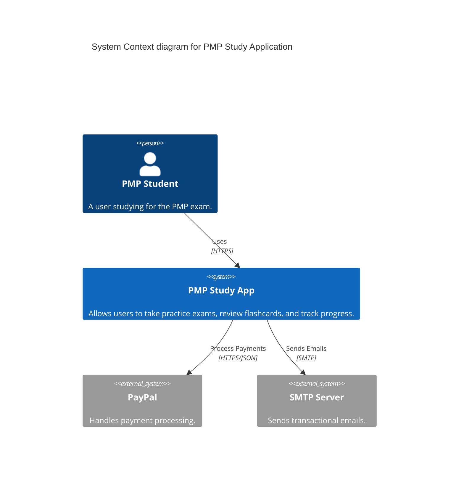
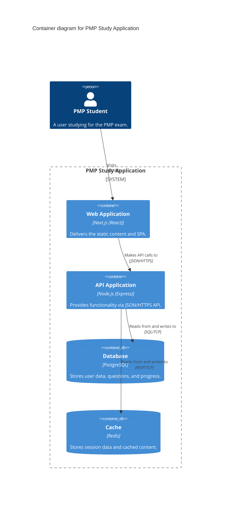

# System Architecture

## C4 Context Diagram

## Container Diagram

## Infrastructure Diagram (AWS)
- **VPC:** 10.0.0.0/16
  - **Public Subnets:** Load Balancers, NAT Gateways.
  - **Private Subnets:** EKS Nodes, RDS, Redis.
- **Compute:** EKS Cluster (Auto-scaling Node Group).
- **Data:** RDS (PostgreSQL Multi-AZ), ElastiCache (Redis).
- **Security:** Security Groups restricting access to internal components.