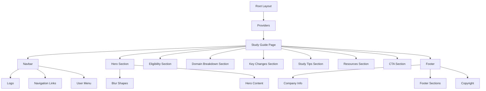

# Study Guide Page Refactoring Plan

## Overview

Refactor the `/study-guide` page to strictly adhere to the Material You design system established on the homepage. This includes using the same global CSS variables, theme providers, and shared layout components (Navbar, Footer).

---

## Current State Analysis

### Issues Identified

| Issue          | Current (Study Guide)         | Expected (Homepage)                                       |
| -------------- | ----------------------------- | --------------------------------------------------------- |
| Layout         | `min-h-screen bg-gray-900`    | Uses `bg-md-background` via body styles                   |
| Navbar         | Missing                       | `<Navbar />` component                                    |
| Footer         | Missing                       | `<Footer />` component                                    |
| Container      | `max-w-6xl`                   | `max-w-7xl`                                               |
| Typography     | `text-white`, `text-gray-300` | `text-md-on-background`, `text-md-on-surface-variant`     |
| Backgrounds    | `bg-gray-800`, `bg-gray-900`  | `bg-md-surface-container`, `bg-md-surface-container-low`  |
| Buttons        | Custom styles                 | `btn btn-primary`, `btn btn-secondary`, `btn btn-outline` |
| Cards          | Custom styles                 | `card`, `card-interactive`                                |
| Badges         | Custom styles                 | `badge badge-primary`                                     |
| Visual effects | Static backgrounds            | Organic blur shapes (`blur-shape`)                        |
| Gradient text  | Inline classes                | `.text-gradient` utility                                  |

---

## Design System Reference

### Color Palette (Material You)

```css
/* Backgrounds & Surfaces */
--md-background: #fffbfe --md-on-background: #1c1b1f --md-surface: #fffbfe
  --md-surface-variant: #e7e0ec --md-surface-container: #f3edf7 --md-surface-container-low: #f7f2fa
  /* Primary (Seed: #6750A4) */ --md-primary: #6750a4 --md-on-primary: #ffffff
  --md-primary-container: #eaddff --md-on-primary-container: #21005d /* Secondary */
  --md-secondary: #625b71 --md-on-secondary: #ffffff --md-secondary-container: #e8def8
  /* Tertiary */ --md-tertiary: #7d5260 --md-on-tertiary: #ffffff /* Outline */
  --md-outline: #79747e;
```

### Component Classes

| Component        | CSS Class                  |
| ---------------- | -------------------------- |
| Primary Button   | `btn btn-primary`          |
| Secondary Button | `btn btn-secondary`        |
| Outlined Button  | `btn btn-outline`          |
| Card             | `card`                     |
| Interactive Card | `card card-interactive`    |
| Primary Badge    | `badge badge-primary`      |
| Text Gradient    | `text-gradient`            |
| Blur Shape       | `blur-shape bg-md-primary` |

---

## Detailed Refactoring Steps

### Step 1: Add Imports

```tsx
// Add to existing imports
import { Navbar } from '@/components/Navbar';
import { Footer } from '@/components/Footer';
```

### Step 2: Update Page Wrapper

**Current:**

```tsx
<div className="min-h-screen bg-gray-900">
```

**Expected:**

```tsx
<div className="min-h-screen">
  <Navbar />
  {/* page content */}
  <Footer />
</div>
```

### Step 3: Update Section Backgrounds

| Section          | Current                                                    | Expected                                        |
| ---------------- | ---------------------------------------------------------- | ----------------------------------------------- |
| Hero             | `bg-gradient-to-br from-gray-900 via-gray-800 to-gray-900` | Section wrapper with blur shapes                |
| Eligibility      | Default (transparent)                                      | `bg-md-surface-container-low`                   |
| Domain Breakdown | `bg-gray-800/50`                                           | `bg-md-surface-container-low`                   |
| Key Changes      | Default                                                    | `bg-md-surface-container-low`                   |
| Study Tips       | `bg-gray-800/50`                                           | `bg-md-surface-container-low`                   |
| Resources        | Default                                                    | `bg-md-surface-container-low`                   |
| CTA              | `bg-gradient-to-r from-blue-600 to-violet-600`             | `bg-md-primary-container` with appropriate text |

### Step 4: Update Typography Classes

| Element      | Current                          | Expected                     |
| ------------ | -------------------------------- | ---------------------------- |
| Headings     | `text-white`                     | `text-md-on-background`      |
| Body text    | `text-gray-300`, `text-gray-400` | `text-md-on-surface-variant` |
| Hero title   | Custom gradient                  | `text-gradient`              |
| Stats values | `text-white`                     | `text-gradient`              |

### Step 5: Update Buttons

| Button        | Current                         | Expected            |
| ------------- | ------------------------------- | ------------------- |
| Primary CTA   | `bg-blue-600 hover:bg-blue-700` | `btn btn-primary`   |
| Secondary CTA | `bg-gray-700 hover:bg-gray-600` | `btn btn-secondary` |
| Outline CTA   | Custom border                   | `btn btn-outline`   |

### Step 6: Update Cards

**Current:**

```tsx
className = 'bg-gray-800 border border-gray-700 rounded-xl p-6';
```

**Expected:**

```tsx
className = 'card';
```

### Step 7: Update Badges

**Current:**

```tsx
className =
  'inline-flex items-center px-4 py-2 bg-blue-500/10 border border-blue-500/30 rounded-full text-blue-400 text-sm font-medium';
```

**Expected:**

```tsx
className = 'badge badge-primary';
```

### Step 8: Add Organic Blur Shapes

Add to hero section:

```tsx
<div className="blur-shape bg-md-primary w-96 h-96 top-0 left-0 -translate-x-1/2 -translate-y-1/2"></div>
<div className="blur-shape bg-md-tertiary w-96 h-96 bottom-0 right-0 translate-x-1/2 translate-y-1/2"></div>
```

### Step 9: Update Container Widths

Change all `max-w-6xl` to `max-w-7xl`

---

## Mermaid Diagram: Component Structure



---

## File Changes Summary

| File                                        | Changes                                |
| ------------------------------------------- | -------------------------------------- |
| `packages/web/src/app/study-guide/page.tsx` | Complete refactor to use design system |

---

## Testing Checklist

- [ ] Page loads without errors
- [ ] Navbar displays correctly with proper navigation links
- [ ] Footer displays with all links functional
- [ ] Typography is consistent with homepage
- [ ] Colors match Material You design system
- [ ] Buttons have correct hover/focus states
- [ ] Cards have proper elevation and hover effects
- [ ] Mobile responsive layout works correctly
- [ ] Dark mode support works (if applicable)
- [ ] All interactive elements function correctly

---

## Rollback Plan

If issues arise, the original file is versioned in git. Rollback command:

```bash
git checkout HEAD~1 -- packages/web/src/app/study-guide/page.tsx
```
